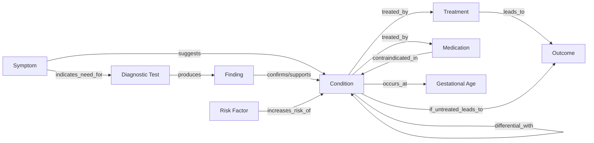

# Medical Intake Assistant & Clinical Knowledge Graph Builder

This project provides a conversational medical intake assistant leveraging LLMs for patient interviews, and a pipeline that analyzes conversations to extract structured clinical knowledge graphs.

## Overview

The project centers on two main scripts:

- **agent.py:** An interactive assistant that conducts an intake (specializing in first trimester pregnancies), gathers symptoms, summarizes information, and generates a clinical analysis using LLMs.
- **kg_drafter.py:** Extracts structured entities and relations from the clinical analysis to build a knowledge graph, outputs Neo4j Cypher queries, and saves results as JSON and Cypher scripts.

---

## Features

- Interactive patient interview powered by LLMs (LangChain & OpenAI/MedGemma via Ollama).
- Automatic thesis/clinical summary generation.
- Extraction of clinical entities (symptoms, diagnoses, labs, treatments, risk factors, etc.) and relationships.
- Automatic generation of a medical knowledge graph (with Cypher queries for Neo4j and JSON files).
- Knowledge graph can be enhanced by LLM medical background knowledge (optional).
- Modular code for easy integration.

---

## Ontology & Knowledge Graph Schema

The knowledge graph produced by this project is based on a clinical ontology, capturing the main clinical entities and their relationships. This schema provides a structure for graph-based reasoning, analytics, and visualization.

### Entity Types

- **Symptom**
- **Condition** (Diagnosis)
- **Diagnostic Test**
- **Finding** (Lab result, Imaging, etc.)
- **Treatment**
- **Medication**
- **Outcome**
- **Risk Factor**
- **Gestational Age**

### Relationships

- Symptom → suggests → Condition
- Symptom → indicates_need_for → Diagnostic Test
- Diagnostic Test → produces → Finding
- Finding → confirms/supports → Condition
- Condition → treated_by → Treatment / Medication
- Treatment → leads_to → Outcome
- Condition → if_untreated_leads_to → Outcome
- Medication → contraindicated_in → Condition
- Condition → differential_with → Condition
- Risk Factor → increases_risk_of → Condition
- Condition → occurs_at → Gestational Age

### Visual Schema

You can view the schema as a diagram (if supported by your markdown viewer):



_This schema underpins the knowledge graph output by the system and governs Neo4j graph generation._

---

## Setup

1. **Python Environment:**
   - Requires Python 3.9+.
   - Recommended to use a virtual environment.
2. **Install Dependencies:**
   ```bash
   pip install langchain langchain-openai langchain-core pydantic neo4j ollama
   ```
   - Ensure Ollama is running locally if using MedGemma.
   - Set OpenAI API Keys appropriately in code or via environment variables.

3. **Neo4j Database:**
   - Optional, for graph import/visualization.
   - Run a local Neo4j instance at default `bolt://localhost:7687` (user: neo4j / pass: password, or change in `kg_drafter.py`).

---

## Usage

### 1. Running the Medical Intake Agent

Start the assistant:

```bash
python agent.py
```

- The assistant will guide you through a series of intake questions.
- After confirmation, it will summarize, run a clinical analysis, and automatically build/export a knowledge graph of the case.

### 2. Structure

#### **agent.py**

- Uses stateful LangGraph for dialog state, with clear node functions for handling user input, assistant tasks, and diagnosis generation.
- Leverages OpenAI for agent dialog and MedGemma (Ollama) for clinical thesis generation.
- At the end of intake, generates a summary and invokes thesis analysis, then calls `kg_drafter.integrate_with_intake_script()` to produce the knowledge graph.

#### **kg_drafter.py**

- Defines clinical entities (`ClinicalEntity`, `ClinicalRelationship`, etc.) and parsing logic.
- Uses OpenAI / LLMs to extract structured JSON from free-text analysis, build relationships, and optionally enhance knowledge using medical background.
- Generates Cypher queries for graph import and saves both JSON and Cypher files.
- Provides utilities for batch ingest into Neo4j and database management.

---

### 3. Workflow

1. **Interview**: `agent.py` runs a medical intake conversation with the patient.
2. **Summarize & Analyze**: After data collection, summarizes the case and creates a clinical thesis (`thesis_generator`).
3. **Knowledge Graph Construction**: Passes results to `kg_drafter.integrate_with_intake_script`, which:
   - Extracts entities and relationships.
   - Generates and saves `medical_case_<id>.json` and `medical_case_<id>.cypher`.
4. **Import to Neo4j** (optional): Use the saved Cypher file to import into your Neo4j instance.

---

## File Outputs

- `medical_case_<id>.json`: Structured representation of the clinical case.
- `medical_case_<id>.cypher`: Cypher statements for Neo4j import.

---

## Customization

- **Prompts and LLMs**: Change prompts/LLM models in source files as needed.
- **Database Connection**: Update Neo4j credentials in `kg_drafter.py` if using a database.

---

## Example

```
Medical Intake Assistant (type 'quit' to exit)
Patient: I feel tired for two weeks.
Assistant: Is there anything else we haven't covered?
Patient: No, that's all.
🧾 Clinical Analysis:
[...summary...]
🔬 Knowledge Graph Built Successfully!
Files saved: medical_case_<id>.json and .cypher
```

