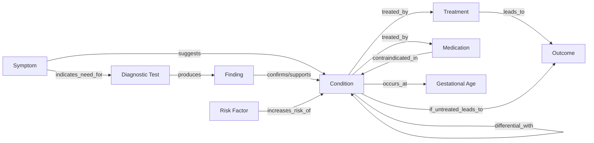

```mermaid
graph LR

%% Node Definitions
Symptom["Symptom"]
DiagnosticTest["Diagnostic Test"]
Finding["Finding"]
Condition["Condition"]
Treatment["Treatment"]
Medication["Medication"]
Outcome["Outcome"]
RiskFactor["Risk Factor"]
GestationalAge["Gestational Age"]

%% Edges (Ontology Relationships)
Symptom -->|suggests| Condition
Symptom -->|indicates_need_for| DiagnosticTest
DiagnosticTest -->|produces| Finding
Finding -->|confirms/supports| Condition
Condition -->|treated_by| Treatment
Condition -->|treated_by| Medication
Treatment -->|leads_to| Outcome
Condition -->|if_untreated_leads_to| Outcome
Medication -->|contraindicated_in| Condition
Condition -->|differential_with| Condition
RiskFactor -->|increases_risk_of| Condition
Condition -->|occurs_at| GestationalAge
```
